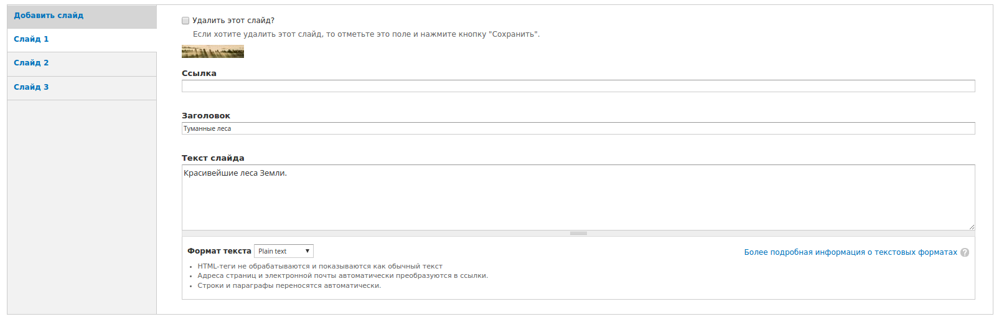
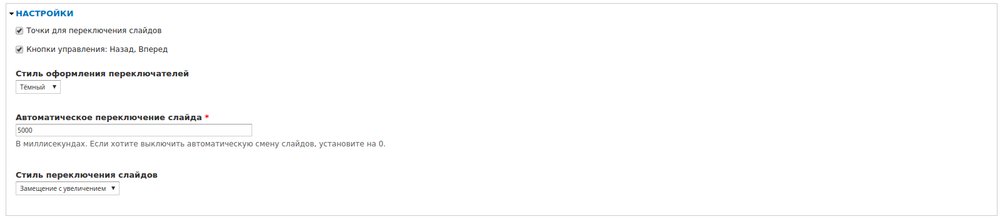

# Слайдер

Слайдер основаный на OwlCarousel.

**Скриншоты в конце описания**

* Смена цвета оформления
* Смена стиля переключения
* Настройка автопрокрутки
* Элементы управления слайдером
* Слайд как ссылка
* Заголовок и описание
* Адаптирован под мобильные устройства
* Перелистывание рукой на мобильных устройствах

Требуемые модули от SL7:
* [sl7_control_panel](https://github.com/SemyonDragunov/sl7_control_panel)

Для Drupal 7. PHP =< 5.4 Jquery =< 1.7

Для продолжения разработки css смотрите bower.json

Автор: Семён Драгунов [sam.dragunov@gmail.com](sam.dragunov@gmail.com)

Apache License 2.0

Если необходима английская версия модуля, пишите **@SemyonDragunov**

***
# Slider

Slider based on OwlCarousel.

**Screenshots at the end of the this description**

* Color change
* Change of switching style
* Auto-scroll setting
* Slider controls
* Slide as link
* Title and description
* Adapted for mobile devices
* Turning your hand on mobile devices

Required modules from SL7:
* [sl7_control_panel](https://github.com/SemyonDragunov/sl7_control_panel)

For Drupal 7. PHP =< 5.4 Jquery =< 1.7

To continue developing css, see bower.json

Author: Semyon Dragunov [sam.dragunov@gmail.com](sam.dragunov@gmail.com)

Apache License 2.0

If you need an English version of the module, write to user **@SemyonDragunov**

***

